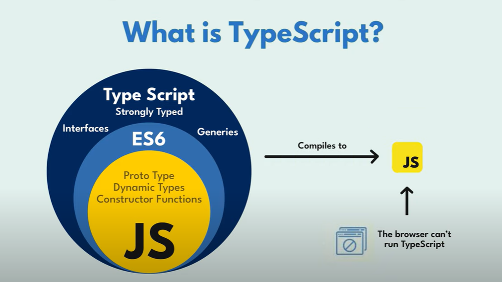

# Typescript Course
## What is Typescript?
Typescript is a **Superset** of Javascript that adds **Static typing** and other features to enhance Javascript development.

### Advantages

- Easy to Read Write and Maintain  
- Shows error at Compile time.
- Provide type inference, means it automatically defines the datatype after assigning value to it.

### Disadvantage
> Browsers cant understand the Typescript directly so typescript file needs to be converted to Javascript file.

## Installation of Typescript
- Install VS Code editor
- Install NodeJS
- In Terminal run the below command
```
npm install -g typescript
```
- Check the installation with command below
```
 tsc --v
```
- Typescript compiler used to convert typescript file to javascript file.



## Typescript Code
```jsx
let num: number = 10;

console.log(num)
```
Here in the above code we have defined the type of the variable num explicitly as **number**. This is called static typing.  
```
tsc index.ts
```
- The above command will generate the Javascript file **index.js**.

### Setup Configuration for Typescript
---
Run the below command to generate and configure the **tsconfig.json** file.
```
tsc --init
```
### In the **tsconfig.json** there are many configurations  
 ```
noEmitOnError: true
```
- If set to true in the TypeScript config file **(tsconfig.json)**, this option prevents the JavaScript files from being generated if there are any compilation errors in the TypeScript code.

## Type Annotation
In Typescript, type annotation is a way of explicitly specifying the type of a variable, function parameter or a function return value.
- Type annotations are expressed by using a colan (:) followed by the desired type after the variable or function parameter declaration. There can be a space after colan.
```jsx
let myFavNum: number = 20;
let name: string = "Abhi";
```
### Advantages:
- It helps the Typescript compiler to enforce type checking and provide type safety during development.
- It helps determines what kind of operations that can be performed on that variable or value.
## Types in Typescript

